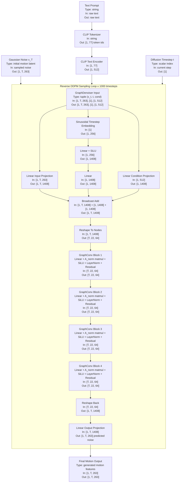

This model is a text-conditioned DDPM pipeline: the input prompt is tokenized and encoded into a 512-dim CLIP embedding, reverse diffusion starts from Gaussian noise in motion feature space `[1, T, 263]`, and at each timestep the `GraphDenoiser` predicts noise using timestep conditioning plus a 4-layer graph convolution stack over the 22-joint skeleton before producing the final motion sequence `[1, T, 263]`.

